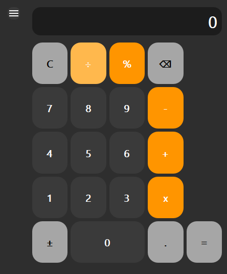
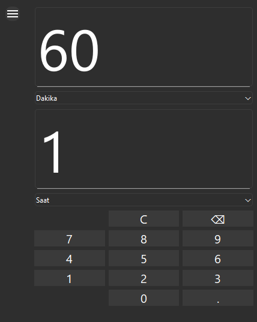
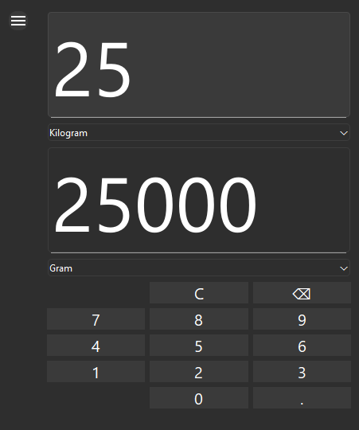
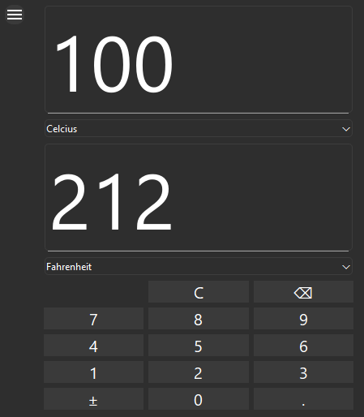

Hesap Makinesi & Birim Çevirici (Qt) / Calculator & Converter (Qt)

Qt Framework kullanılarak geliştirilmiş basit bir Hesap Makinesi ve Birim Çevirici uygulaması. Kullanıcılar, temel aritmetik işlemleri yapabilir ve farklı birimler arasında dönüşüm gerçekleştirebilir. Kullanıcı dostu arayüz ile kolay kullanım sağlar.

A simple Calculator and Unit Converter application built with Qt Framework. Users can perform basic arithmetic operations and convert between different units with an intuitive and user-friendly interface.

TR - Özellikler
Hesap Makinesi

Toplama, çıkarma, çarpma ve bölme işlemleri

Temizleme ve geri alma (backspace) fonksiyonu

Gerçek zamanlı giriş görüntüleme

Birim Çevirici

Yaygın birimler arasında dönüşüm (zaman, ağırlık, sıcaklık vb.)

Basit ve anlaşılır arayüz

Yeni birimler eklemeye kolayca uyarlanabilir

Ekran Görüntüleri
Hesap Makinesi

  

Birim Çevirici

    

EN - Features
Calculator

Addition, subtraction, multiplication, and division

Clear and backspace functionality

Real-time input display

Unit Converter

Convert between common units (time, weight, temperature, etc.)

Simple and intuitive interface

Easily extendable to add new units

Screenshots
Calculator

  

Unit Converter

    

Teknolojiler / Technologies

Programlama Dili / Programming Language: C++

Framework: Qt (Qt Widgets)

IDE: Qt Creator
